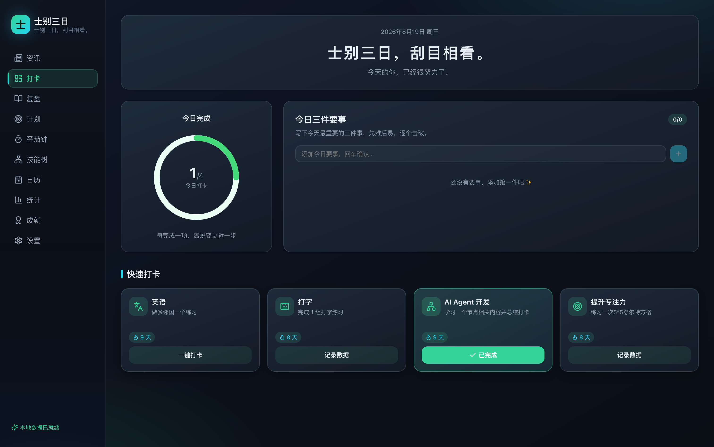
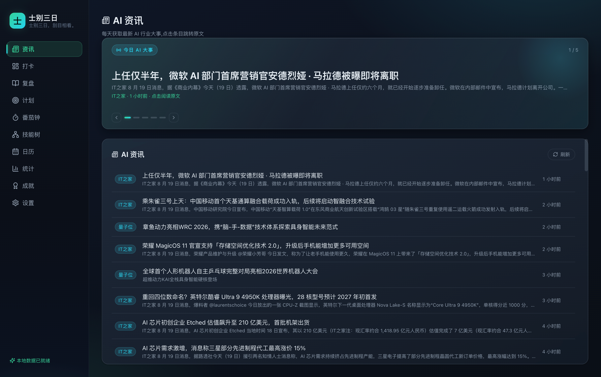
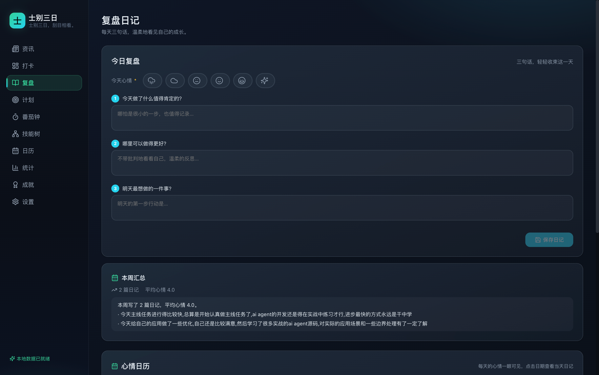
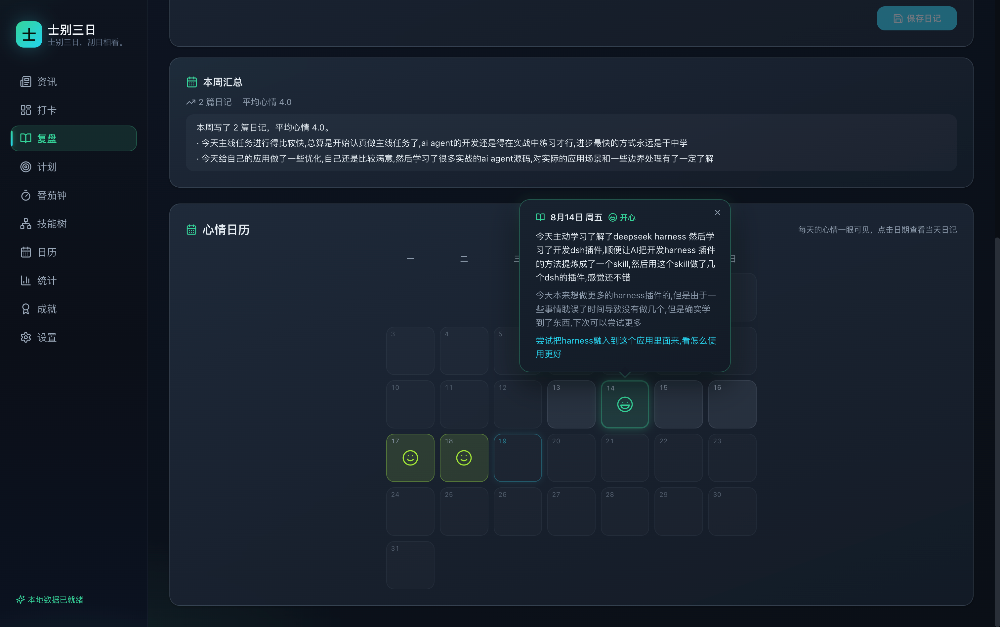

# 士别三日 (shibie)

> 士别三日，刮目相看。

一款深色科技风的**本地优先自律工作台**:计划、打卡、番茄钟、复盘日记、技能树、成就系统一应俱全,并内置**每日 AI 资讯聚合**(多源 RSS 抓取 + AI 关键词筛选 + 头条轮播)。基于 Electron + React + SQLite,所有数据保存在本地,无账号、无云端、无遥测。

我始终相信,所有事情都是熟能生巧,只要坚持下去,都会变得得心应手。

后悔和

你想好了吗?你想活出怎样的人生?

## 截图预览

| 今日打卡 | AI 资讯 |
|:---:|:---:|
|  |  |

| 复盘日记 | 心情日历 |
|:---:|:---:|
|  |  |

## 功能特性

- 📰 **AI 资讯**:多源中文 RSS 聚合(机器之心/量子位/AIbase/36氪/虎嗅/IT之家),AI 关键词筛选,每日头条轮播 + 列表点击跳原文,每 6 小时自动刷新
- ✅ **今日打卡**:每日完成环形进度 + 三件要事 + 快速打卡卡片
- 🗓️ **打卡日历**:按月查看打卡记录,支持数值型指标与学习证据(截图/视频)附件
- 🍅 **番茄钟**:专注/休息循环,全屏专注模式,时长自动计入关联计划
- 📝 **复盘日记**:每天三句话 + 六档心情图标,心情日历一眼回看,点击日期气泡查看当天日记
- 🌳 **技能树**:AI Agent 学习路径,节点状态流转
- 📊 **统计**:热力图、完成率、WPM 趋势等(ECharts 深色主题)
- 🏅 **成就系统**:连续打卡/专注时长等勋章
- 💾 **数据本地化**:SQLite 本地存储,支持一键导出/导入备份

## 快速开始

```bash
# 安装依赖（postinstall 会自动 rebuild + 签名加固）
npm install

# 启动开发
npm run dev

# 类型检查
npm run typecheck
```

### macOS 开发注意事项

Electron 二进制会被 macOS XProtect/Gatekeeper 拦截清除。postinstall 已自动处理：
- ad-hoc 重签名（规避 XProtect 签名匹配）
- 去除 quarantine 属性（规避 Gatekeeper 拦截）

如仍被清除，手动执行：
```bash
npm run dequarantine
```

## 项目结构

```
shibie/
├─ electron/
│  ├─ main.ts          # 主进程入口
│  ├─ preload.ts       # contextBridge IPC 桥
│  └─ db/
│     ├─ connection.ts # SQLite 连接管理
│     ├─ migrations.ts # 建表迁移
│     └─ repositories/ # 各表 Repository
├─ src/
│  ├─ modules/         # 业务模块
│  │  ├─ news/         # AI 资讯(RSS 聚合)
│  │  ├─ dashboard/    # 今日打卡驾驶舱
│  │  ├─ plans/        # 计划管理
│  │  ├─ habits/       # 打卡日历
│  │  ├─ timer/        # 番茄钟 + 全屏专注
│  │  ├─ stats/        # 统计 + 热力图 + WPM
│  │  ├─ skills/       # AI Agent 技能树
│  │  ├─ journal/      # 复盘日记
│  │  ├─ achievements/ # 成就 + 初心板
│  │  └─ settings/     # 设置 + 导入导出
│  ├─ hooks/           # React 数据 hooks
│  ├─ store/           # Zustand 状态管理
│  ├─ theme/           # Less 变量 + ECharts 主题
│  └─ utils/           # platform.ts / icons / echarts
├─ shared/
│  ├─ types/           # 统一类型定义
│  ├─ contracts/       # Repository 接口 + API 契约
│  └─ constants/       # 常量（技能树、种子计划等）
├─ build/              # 图标资源
├─ mcp-server/         # 配套 MCP Server(可选,供 LLM 客户端操作本应用数据)
└─ scripts/
   └─ postinstall.js   # rebuild + 签名加固
```

## 打包

### mac dmg（本阶段实际构建）

```bash
npm run build:mac
```

输出到 `release/` 目录。

### Windows / Linux（配置预留）

```bash
# Windows（nsis）
npm run build:win

# Linux（AppImage）
npm run build:linux
```

**注意**：better-sqlite3 是原生模块，Win/Linux 包必须在对应平台或 GitHub Actions 矩阵中构建。
mac 打的包不能直接跨平台运行。

### GitHub Actions CI 矩阵（未来）

```yaml
strategy:
  matrix:
    include:
      - os: macos-latest
        cmd: npm run build:mac
      - os: windows-latest
        cmd: npm run build:win
      - os: ubuntu-latest
        cmd: npm run build:linux
steps:
  - uses: actions/checkout@v4
  - uses: actions/setup-node@v4
    with:
      node-version: 20
  - run: npm install
  - run: ${{ matrix.cmd }}
  - uses: actions/upload-artifact@v4
    with:
      name: shibie-${{ matrix.os }}
      path: release/*
```

## 技术栈

| 层 | 技术 |
|---|---|
| 桌面框架 | Electron 31 |
| 渲染层 | React 18 + TypeScript + Vite |
| 样式 | Less（深色科技风变量体系 + 玻璃拟态卡片） |
| 数据库 | better-sqlite3（仅主进程） |
| 通信 | contextBridge + ipcRenderer（禁 nodeIntegration） |
| 状态管理 | Zustand |
| 图表 | ECharts（深色主题） |
| 图标 | lucide-react |

## 核心设计

- **凌晨 4:00 重置**：日期工具统一封装，每日重置时间可配置
- **断卡不归零**：streak 计算含"今日宽限"，补卡可恢复连续
- **软删除**：业务表统一含 `deleted_at`，数据不丢失
- **本地优先**：所有数据存 SQLite，设置存 localStorage，无云端依赖

## 三个优先迭代点

1. **每日定时提醒**：当前仅有番茄钟结束通知，需增加每日固定时间（如上午 9:00、晚上 8:00）的打卡提醒，使用 Electron Notification + 后台定时器。
2. **计划拖拽排序**：计划列表当前按 `sort_order` 固定排列，需加入拖拽重排能力（如 `@dnd-kit/sortable`），持久化排序到 DB。
3. **数据统计增强 + 周报导出**：当前统计为基础聚合，需增加累计专注时长统计（从 PomodoroSession 聚合）、月度趋势对比、以及将复盘日记+统计数据导出为周报 PDF/Markdown。

## 开源说明与隐私

- **许可证**:MIT,可自由使用、修改、分发
- **数据隐私**:所有打卡/日记/计划数据仅存于本地 SQLite(`~/Library/Application Support/shibie/` 等 userData 目录),无云端同步、无遥测、无账号体系
- **网络请求**:应用内唯一的网络行为是抓取公开的 AI 资讯 RSS 源,不发送任何用户数据
- **无密钥依赖**:项目不包含任何 API Key / Secret,RSS 源均为公开地址
- **欢迎 PR / Issue**:功能建议与 Bug 反馈都欢迎

## 致谢

- 图标:[lucide-react](https://lucide.dev)
- 资讯来源:机器之心、量子位、AIbase、36氪、虎嗅、IT之家(版权归原作者所有)
```
